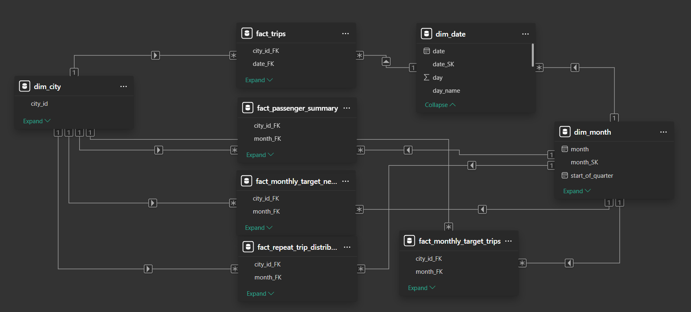
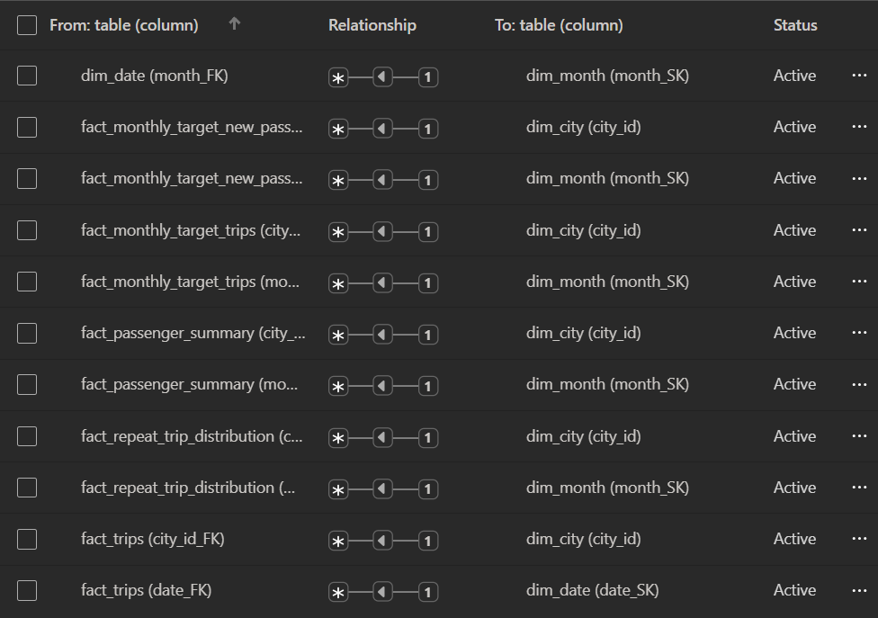

# 📊 **Goodcabs – Dimensional Modelling Document**

_(Power BI – Star Schema Design)_

This document describes the **fact tables** , **dimension tables** , and **star schemas** used to model Goodcabs’ analytical environment for Power BI.

The design aligns with Kimball dimensional modelling best practices.

---

# ✅ **1. Fact Tables – Type Classification**

Goodcabs' datasets fall into two broad fact types:

1. **Transactional Fact**
2. **Periodic Snapshot Fact**

We classify fact tables based on:

- **Granularity**
- **Time behavior**
- **Aggregation pattern**
- **Event vs. snapshot nature**

## **1️⃣ fact_trips → Transactional Fact (Event Fact)**

### **Grain:**

**One row per trip** (`trip_id`, a Natural Key)

### **Why transactional?**

- Captures individual trip events
- Contains atomic measures (fare, distance, duration, rating)
- Fully additive across time, city, passenger type

## **2️⃣ fact_passenger_summary → Periodic Snapshot Fact**

### **Grain:**

**One row per month × city**

### **Why periodic snapshot?**

- Pre-aggregated monthly passenger metrics
- Measures: total passengers, new passengers, repeat passengers
- Captured repeatedly at **monthly intervals**

## **3️⃣ fact_repeat_trip_distribution → Periodic Snapshot Fact**

_(Renamed from dim_repeat_trip_distribution)_

### **Grain:**

**One row per month × city × trip-count bucket**

### **Why renamed as a FACT?**

- It **contains measures** (passenger counts per bucket)
- It is **not** a dimension—it **changes every month**
- It uses **trip frequency buckets** as categories

## **4️⃣ Monthly Target Fact Tables → Periodic Snapshot Facts**

These represent **planned monthly targets** , not actuals.

Tables:

- **fact_monthly_target_trips**
- **fact_monthly_target_new_passengers**
- **fact_city_target_passenger_rating**

### **Grain:**

- Monthly targets → **month × city**
- Annual city rating targets → **city**

### **Why periodic snapshot?**

- Targets change periodically
- Not tied to individual events
- Used for performance vs. target comparison

# 📌 **Summary of Fact Table Types**

| Fact Table Name                        | Fact Type              | Grain                                |
| -------------------------------------- | ---------------------- | ------------------------------------ |
| **fact_trips**                         | Transactional Fact     | trip_id                              |
| **fact_passenger_summary**             | Periodic Snapshot Fact | month × city                         |
| **fact_repeat_trip_distribution**      | Periodic Snapshot Fact | month × city × trip-frequency bucket |
| **fact_monthly_target_trips**          | Periodic Snapshot Fact | month × city                         |
| **fact_monthly_target_new_passengers** | Periodic Snapshot Fact | month × city                         |
| **fact_city_target_passenger_rating**  | Periodic Snapshot Fact | city                                 |

---

# ✅ **2. Dimension Tables (Design + Justification)**

Goodcabs requires dimensions for time, location, passenger type, and trip buckets.

## **1️⃣ dim_city (Merged Dimension)**

Merged from:

- dim_city
- city_target_passenger_rating

### **Why merge?**

City-specific targets (annual rating targets, goals) are **attributes** , not facts.

Therefore they belong inside the city dimension.

## **2️⃣ dim_date**

Primary date dimension for **fact_trips** .

Used for:

Daily trend analysis.

## **3️⃣ dim_month**

Needed because many facts are **monthly** :

- passenger summary
- monthly targets
- repeat distribution

Used for:

Month-level relationships and time intelligence.

---

# ✅ **3. Star Schemas (Analytical Models)**

## ⭐ **Star Schema Description for the Goodcabs BI Model**

The Goodcabs Power BI data model follows a **multi-star schema design**, optimized for analyzing **trip performance, passenger behavior, repeat engagement, and monthly business targets**.
The schema is centered around **one transactional fact** and **multiple periodic snapshot facts**, supported by shared conformed dimensions.

Goodcabs requires **multiple star schemas** due to differing grains.

## 🌟 **1. Trip Performance Star (Transactional Star Schema)**

### **Fact Table: `fact_trips`**

This is the **most granular, event-level fact table** where each row represents a single cab trip.

It contains:

- Trip attributes (distance, fare, ratings)
- Foreign keys: `date_FK`, `city_id_FK`, `passenger_type`
- Fully additive metrics: distance_travelled, fare_amount

### **Dimensions:**

1. **`dim_date`**

   - The full calendar date dimension
   - Enables daily/weekly/monthly time intelligence
   - Connects through `date_FK`

2. **`dim_city`**

   - Provides city-level attributes
   - Also includes city-level rating targets
   - Connects through `city_id_FK`

**Purpose:**
Daily trip monitoring, revenue analysis, driver/passenger ratings, fare efficiency, and city-wise performance.

## 🌟 **2. Monthly Passenger Summary Star (Periodic Snapshot Star)**

### **Fact Table: `fact_passenger_summary`**

A **monthly snapshot fact** summarizing new, repeat, and total passengers per city.

- Grain: **city × month**
- Measures: new_passengers, repeat_passengers, total_passengers

### **Dimensions:**

- **`dim_month`** via `month_FK`
- **`dim_city`** via `city_id_FK`

**Purpose:**
Monitor month-on-month growth, customer acquisition, retention, and repeat passenger trends across cities.

## 🌟 **3. Repeat Trip Distribution Star (Frequency Snapshot Star)**

### **Fact Table: `fact_repeat_trip_distribution`**

Tracks how frequently repeat passengers book trips within a month.

- Grain: **city × month × trip_count**
- Measures: repeat_passenger_count

### **Dimensions:**

- `dim_month`
- `dim_city`

**Purpose:**
Understand loyalty depth — e.g., number of passengers who took 2, 3, 5, or more trips.

## 🌟 **4. Monthly Targets Star (Performance Target Stars)**

There are two target fact tables in the schema:

### **a) `fact_monthly_target_trips`**

- Defines planned trip counts per city each month
- Grain: month × city

### **b) `fact_monthly_target_new_passengers`**

- Defines monthly new-passenger targets
- Grain: month × city

### **Dimensions:**

Both tables use:

- `dim_month`
- `dim_city`

**Purpose:**
Compare achieved vs. planned metrics for trips and new passenger acquisition.

## 🌟 **5. Conformed Dimensions Used Across All Stars**

### **`dim_city`**

A unified city dimension storing:

- City identifiers
- City display names
- Target average passenger rating

Used by all fact tables for:

- Consistent reporting
- City-level KPI rollups
- Target comparisons

### **`dim_month`**

A reusable monthly calendar dimension containing:

- Month number
- Month name
- Quarter
- Year
- Start of quarter

Used by all **monthly snapshot fact tables**.

### **`dim_date`**

A daily calendar dimension used exclusively by the trip-level fact.

---

# ⭐ **Overall Schema Design Pattern**

Our model follows a **constellation schema (galaxy schema)**, consisting of:

- **1 transactional star**
- **3 periodic snapshot stars**
- Unified shared dimensions (date, month, city)

This structure ensures:

✔ Trip-level detail is analyzed separately
✔ Monthly summaries and targets stay cleanly aggregated
✔ Conformed dimensions maintain consistency across all stars
✔ Power BI relationships stay simple, high-performing, and intuitive

---

# 🎯 Final Summary

Our ERD represents a **well-modeled, production-grade dimensional warehouse** for Goodcabs.

**Stars included:**

| Star Schema                               | Fact Table                                                    | Grain                     |
| ----------------------------------------- | ------------------------------------------------------------- | ------------------------- |
| Trip Performance Star                     | fact_trips                                                    | One row per trip          |
| Passenger Summary Star                    | fact_passenger_summary                                        | City × Month              |
| Trip Frequency (Repeat Distribution) Star | fact_repeat_trip_distribution                                 | City × Month × Trip Count |
| Monthly Targets Stars                     | fact_monthly_target_trips, fact_monthly_target_new_passengers | City × Month              |

**Dimensions:**

- dim_date
- dim_month
- dim_city

All facts connect cleanly through FK relationships, making it extremely BI-friendly.

---
